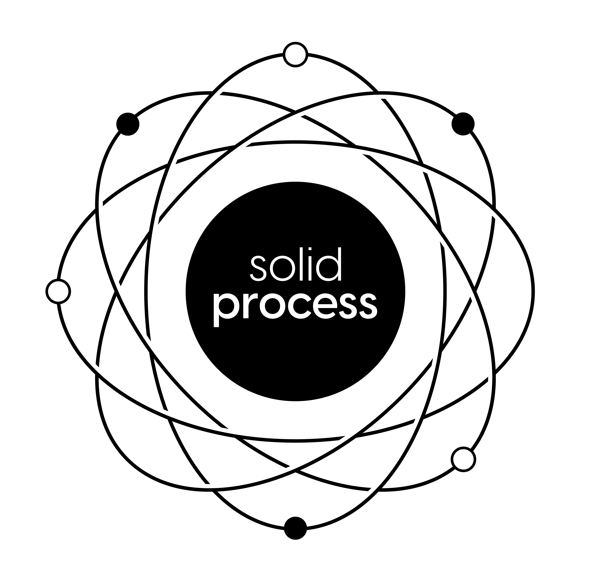
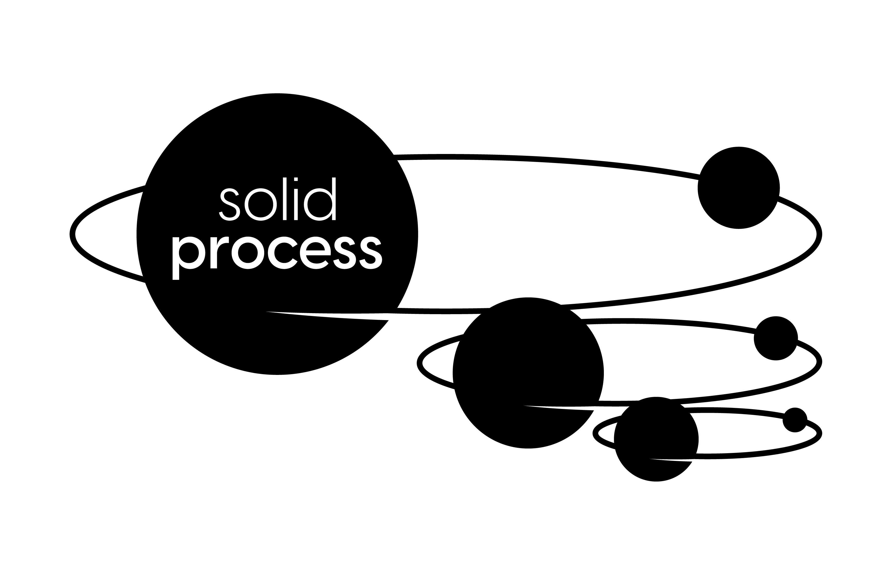
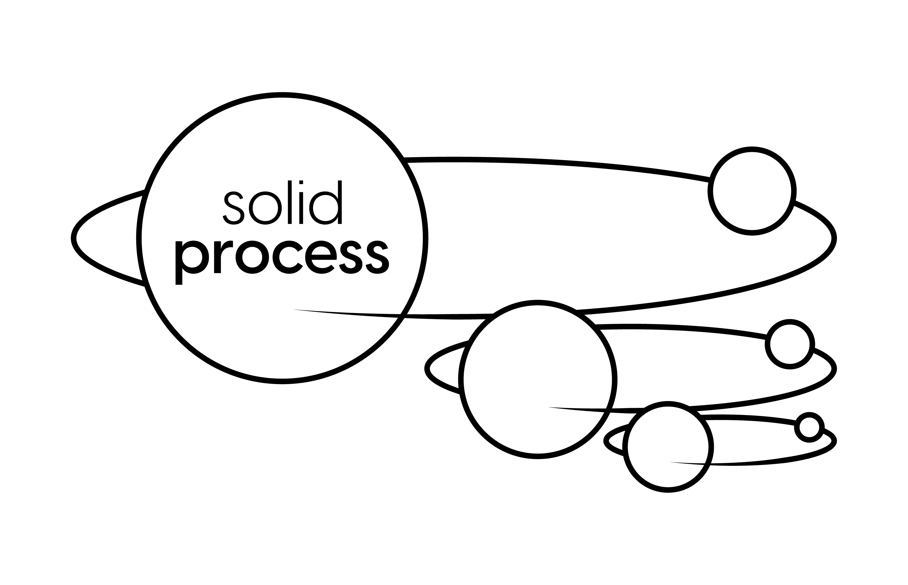
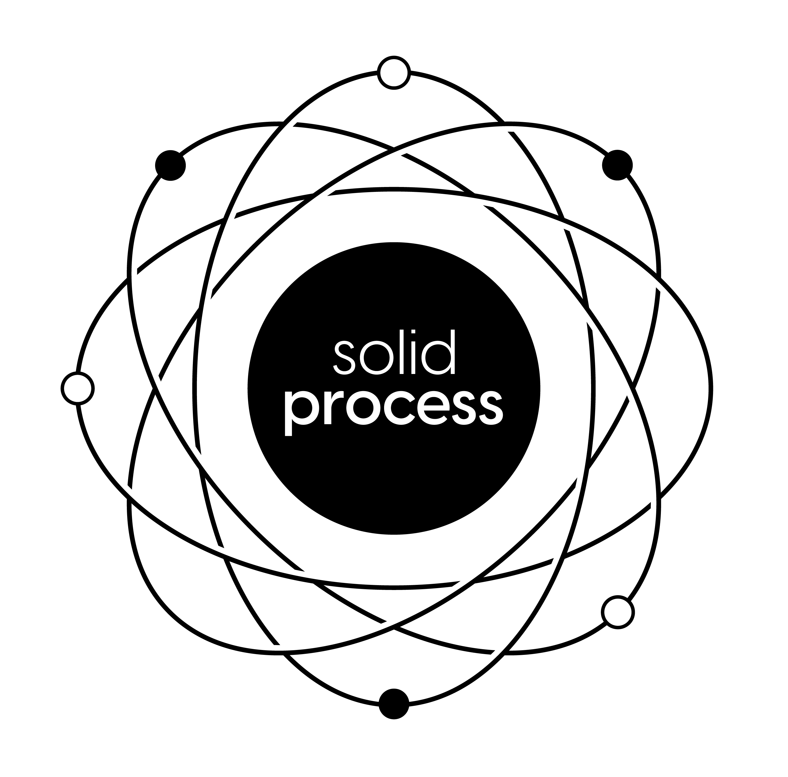
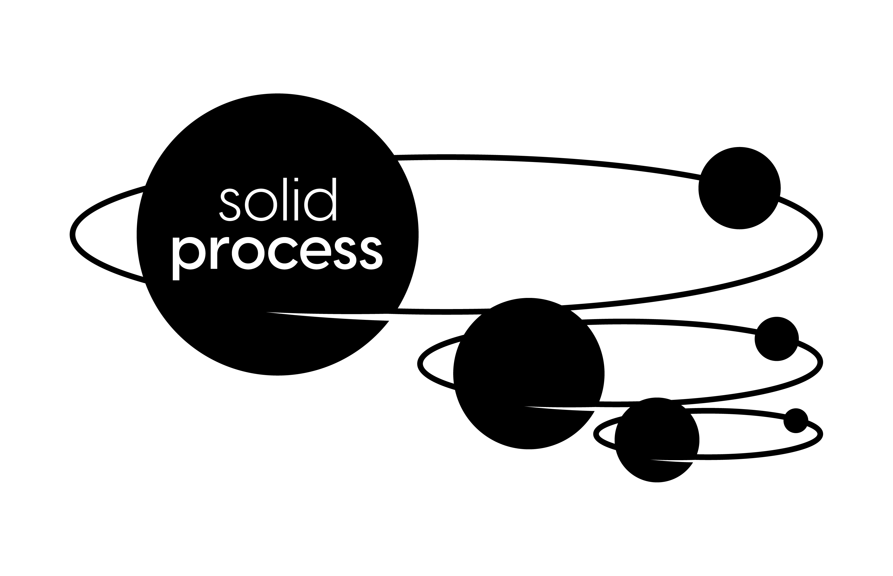
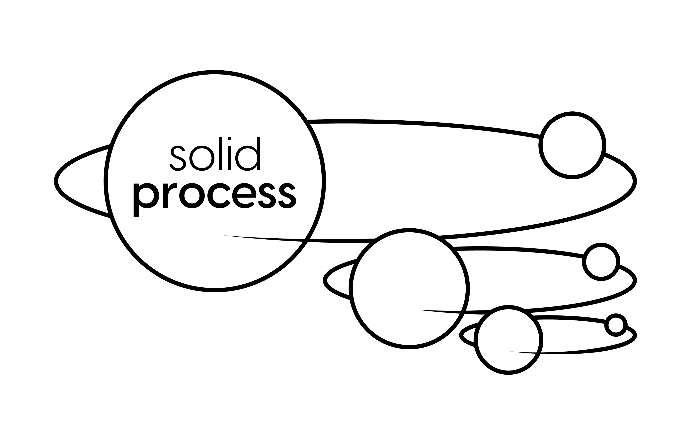

# ✨ Solid Process Assets

This collection of assets can be used to promote/refer to the Solid Process project.

You can access the [`images`](/images) folder to download the pictures.

## Available logos

### Sticker version
<table>
  <tr>
    <td bgcolor="black"></td>
    <td bgcolor="black"></td>
    <td bgcolor="black"></td>
  </tr>
</table>

### Black version (transparent background)

<table>
  <tr>
    <td bgcolor="white"></td>
    <td bgcolor="white"></td>
    <td bgcolor="white"></td>
  </tr>
</table>

### White version (transparent background)

<table>
  <tr>
    <td bgcolor="black"></td>
    <td bgcolor="black"></td>
    <td bgcolor="black"></td>
  </tr>
</table>

## Contributing

Bug reports and pull requests are welcome on GitHub at https://github.com/solid-process/the-assets. This project is intended to be a safe, welcoming space for collaboration, and contributors are expected to adhere to the [code of conduct](https://github.com/solid-process/the-assets/blob/main/CODE_OF_CONDUCT.md).

## License

The gem is available as open source under the terms of the [MIT License](https://opensource.org/licenses/MIT).

## Code of Conduct

Everyone interacting in the Solid::Process project's codebases, issue trackers, chat rooms and mailing lists is expected to follow the [code of conduct](https://github.com/solid-process/solid-process/blob/main/CODE_OF_CONDUCT.md).
